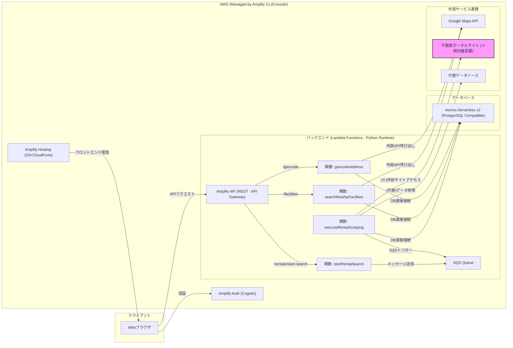

# アーキテクチャ概要

このドキュメントでは、「不動産価値情報収集ツール」の技術アーキテクチャの概要と処理フローについて説明します。

## 1. アーキテクチャ方針

本ツールは、AWS (Amazon Web Services) 上に構築され、**AWS Amplify フレームワーク**を全面的に活用します。バックエンドは**サーバーレスアーキテクチャ**を採用し、API Gateway, AWS Lambda, Amazon SQS, Aurora Serverless v2 (PostgreSQL互換) を主要コンポーネントとします。

この構成により、開発効率の向上、スケーラビリティの確保、運用コストの最適化を目指します。

## 2. アーキテクチャ図

## 3. 主要コンポーネントと役割

- Amplify Hosting (S3+CloudFront): フロントエンドアプリケーション（React/Vue）のホスティングと配信、CI/CD。
- Amplify Auth (Cognito): ユーザー認証（サインアップ、サインイン）機能の提供と管理。
- Amplify API (REST - API Gateway): フロントエンドからのリクエストを受け付け、認証を行い、適切なLambda関数へルーティングするAPIエンドポイント。
- AWS Lambda (Python): 各バックエンド機能（ジオコーディング、施設検索、賃料検索開始、賃料収集実行、結果取得APIなど）を実行するサーバーレス関数。
- Amazon SQS: 賃料情報収集処理を非同期化するためのメッセージキュー。Lambda間の連携に使用。
- Aurora Serverless v2 (PostgreSQL互換): 収集した賃貸物件情報や計算結果などを保存するデータベース。Lambdaから直接接続。
- 外部API (Google Maps Platform): ジオコーディング、施設検索、ルート検索（徒歩時間）に使用。APIキー管理が必要。
- 不動産ポータルサイト / 代替データソース: 賃料情報収集の元データ。（※ポータルサイト利用は利用規約確認が前提）

## 4. 処理フロー概要
1. ユーザー操作とリクエスト: ユーザーがログイン後、住所を入力し検索を実行。フロントエンドは認証情報を付与してバックエンドAPIに「ジオコーディング」「施設検索」「賃料検索開始」をリクエスト。
2. 同期処理と初期表示: バックエンドは「ジオコーディング」「施設検索」を同期的に実行し、結果（緯度経度、施設リスト）を返す。「賃料検索開始」リクエストに対しては、SQSにメッセージを送信し、「処理受付完了」を返す。フロントエンドは地図と施設をまず表示し、賃料エリアは「検索中」とする。
3. 非同期処理: SQSをトリガーに賃料収集用のLambda関数が起動し、バックグラウンドで情報収集、計算、DBへの保存を行う。
4. 結果取得と最終表示: フロントエンドは定期的（またはユーザー操作）にバックエンドへ賃料情報の結果を問い合わせる（ポーリング）。バックエンドはDBを確認し、結果があればそれを返し、なければ「処理中」を返す。フロントエンドは結果を受け取り次第、画面の賃料情報エリアを更新する。